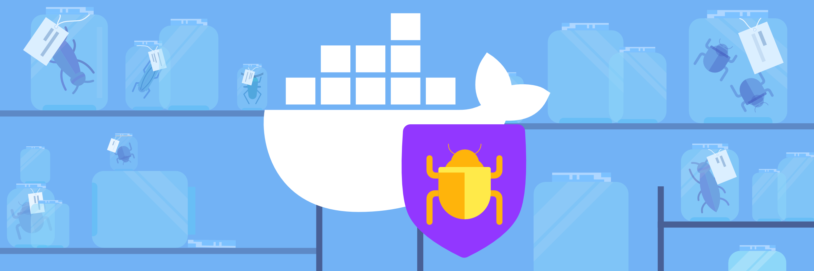
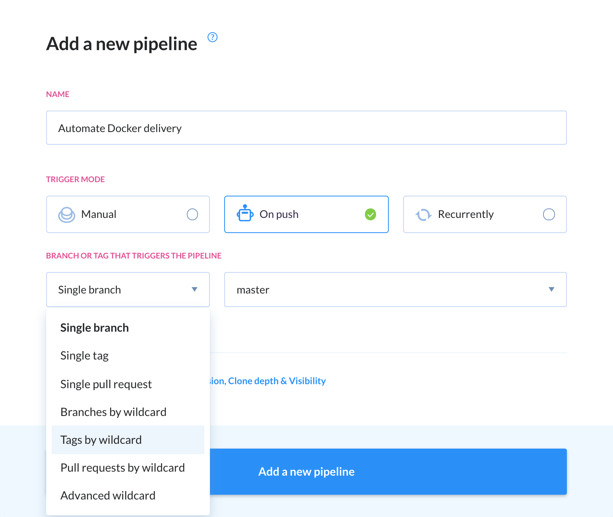
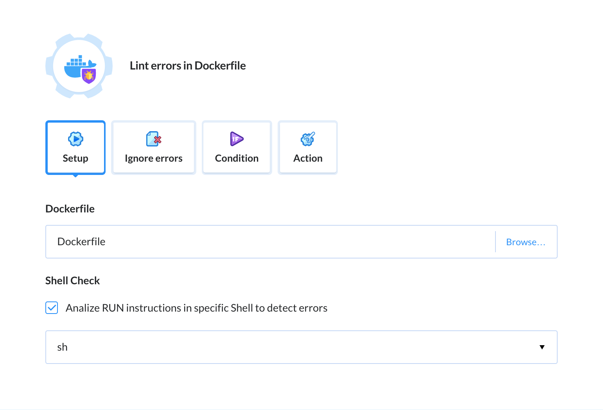
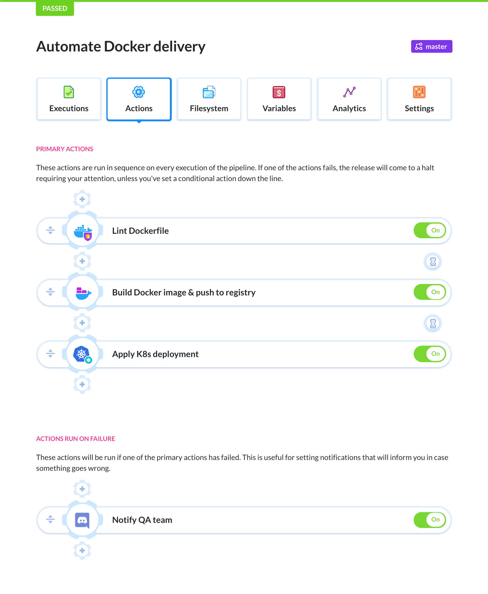

# Dockerfile Linter (written in Node.js) [](https://app.buddy.works/buddy-works/dockerfile-linter/pipelines/pipeline/243198)
## Description

A Dockerfile linter that you can use to quickly check if your Dockerfile follows the [best practices](https://docs.docker.com/develop/develop-images/dockerfile_best-practices/) for building efficient Docker images. The tool uses [ShellCheck](https://github.com/koalaman/shellcheck) analysis tool to lint code in `RUN` instructions. Some of the rules were inspired by [Hadolint](https://github.com/hadolint/hadolint) and [Dockerfile reference](https://docs.docker.com/engine/reference/builder/) documentation.

# Installation
The linter requires Node.js to run:

````
npm install --global dockerlinter
````

# Application
## CLI

The linter can be used directly from the CLI:

````
dockerfilelinter -f <path to Dockerfile>
dockerfilelinter -f <path to Dockerfile> -s bash #default sh
dockerfilelinter -f <path to Dockerfile> -s none #disable shellcheck
dockerfilelinter -f <path to Dockerfile> -i ER0012,ER0015 #coma separated list of ignored rules
dockerfilelinter -f <path to Dockerfile> -e #return error code 1 for any error
dockerfilelinter -f <path to Dockerfile> -e warning,error #return error code 1 for errors with specific level[info, warning, error]
````

## Docker
Docker allows you to run the linter on any type of platform. To mount the file, use the `-v` parameter:

````
docker build . -t imagename
docker run -v /tmp/files/dockerfile:/dockerfilelinter/dockerfile imagename linter -f dockerfile
````

# Inline ignores
You can ignore rules for a specific instruction block in the Dockerfile by commenting it. The ignore comment must be applied above the instruction as `# linter ignore=EF0003`. The exceptions are `ED` and `EL` rules. Example:

````
# linter ignore=EF0003,EF0004
FROM node
````

# YAML file with ignores
You can create YAML file `"your dockerfile name".linter.yaml` with list of ignored rules for specific Dockerfile or for all in folder `dockerfilelinter.yaml`. If you put file in the same folder where linting dockerfile is it will be auto-detected, but you can also use flag `-y/--yaml` to specify a path. Example:
````
ignored:
 - ER0012
 - ER0015
````

# Rules
The list of rules implemented.

- Rules with the `E` prefix come from `dockerfilelinter`. Implementation can be found in `lib/lints.js`.
- Rules with the `SC` prefix come from `ShellCheck`. You can find their description in the tool's [Wiki](https://github.com/koalaman/shellcheck/wiki/). For a more detailed description, use the Pages search tool.

## Legend

`ED` - Error Directives
`EI` - Error Instructions
`ER` - Error RUN
`EC` - Error COPY
`EU` - Error USER
`EF` - Error FROM
`EW` - Error WORKDIR
`EE` - Error EXPORT
`EL` - Error Lines
`EA` - Error ADD
`EJ` - Error JSON


| Rules                     | Description                                                                                                       |
|:--------------------------|:------------------------------------------------------------------------------------------------------------------|
| [EL0001](Rules.md#EL0001) | Invalid line                                                                                                      |
| [ED0001](Rules.md#ED0001) | All parser directives must be at the very top of a Dockerfile.                                                    |
| [ED0002](Rules.md#ED0002) | Directive appears more then once.                                                                                 |
| [ED0003](Rules.md#ED0003) | Directives should be lowercase.                                                                                   |
| [ED0004](Rules.md#ED0004) | Parser directive will be treated as a comment.                                                                    |
| [ED0005](Rules.md#ED0005) | Missing value for directive.                                                                                      |
| [ER0001](Rules.md#ER0001) | Set the `SHELL` option `-o` (`-eo` for Alpine image) pipefail before `RUN` with a pipe in.                        |
| [EU0001](Rules.md#EU0001) | Last user should not be `root`.                                                                                   |
| [EI0001](Rules.md#EI0001) | There can only be one instruction like `(CMD, HEALTHCHECK, ENTRYPOINT)`.                                          |
| [EI0002](Rules.md#EI0002) | `FROM` may only be preceded by one or more `ARG`.                                                                 |
| [EF0001](Rules.md#EF0001) | Missing `FROM`.                                                                                                   |
| [EC0001](Rules.md#EC0001) | `COPY --from` cannot reference its own `FROM` alias.                                                              |
| [EC0002](Rules.md#EC0002) | `COPY --from` should reference a previously defined `FROM` alias.                                                 |
| [EI0003](Rules.md#EI0003) | `MAINTAINER` is deprecated, instead use `LABEL`.                                                                  |
| [EJ0001](Rules.md#EJ0001) | You must use double-quotes (") in JSON array.                                                                     |
| [EJ0002](Rules.md#EJ0002) | `CMD` and `ENTRYPOINT` should be written in JSON form.                                                            |
| [EJ0003](Rules.md#EJ0003) | `SHELL` must be written in JSON form.                                                                             |
| [EF0002](Rules.md#EF0002) | `FROM` aliases must be unique.                                                                                    |
| [EF0003](Rules.md#EF0003) | Using `latest` is prone to errors if the image will ever update.                                                  |
| [EF0004](Rules.md#EF0004) | Always tag the version of an image explicitly.                                                                    |
| [ER0002](Rules.md#ER0002) | Delete the apt-get lists after installing something.                                                              |
| [ER0003](Rules.md#ER0003) | Use `WORKDIR` to switch to a directory.                                                                           |
| [ER0004](Rules.md#ER0004) | Do not use sudo, consider using gosu.                                                                             |
| [ER0005](Rules.md#ER0005) | Command `(ssh, vim, shutdown, service, ps, free, top, kill, mount, ifconfig)` does not make sense in a container. |
| [ER0006](Rules.md#ER0006) | Using `(apt-get upgrade, dist-upgrade, apk upgrade, apt install)` is not recommended.                             |
| [EA0001](Rules.md#EA0001) | Use `curl` or `wget` instead, and delete files when no longer needed.                                             |
| [EC0003](Rules.md#EC0003) | Use `ADD` for extracting archives into a image.                                                                   |
| [ER0007](Rules.md#ER0007) | Either use `wget` or `curl`, but not both.                                                                        |
| [ER0008](Rules.md#ER0008) | Use `SHELL` to change the default shell.                                                                          |
| [ER0009](Rules.md#ER0009) | Use the `-y` switch.                                                                                              |
| [ER0010](Rules.md#ER0010) | Avoid additional packages by specifying `--no-install-recommends`.                                                |
| [EA0002](Rules.md#EA0002) | Use `COPY` instead of `ADD` for files and folders.                                                                |
| [EC0004](Rules.md#EC0004) | `COPY` with more then 2 arguments requires the last argument to end with `/`.                                     |
| [ER0011](Rules.md#ER0011) | Use the `--no-cache` switch.                                                                                      |
| [ER0012](Rules.md#ER0012) | Pin versions in `apt get install`.                                                                                |
| [ER0013](Rules.md#ER0013) | Pin versions in `pip install`.                                                                                    |
| [ER0014](Rules.md#ER0014) | Pin versions in `npm install`.                                                                                    |
| [ER0015](Rules.md#ER0015) | Pin versions in `apk add`.                                                                                        |
| [ER0016](Rules.md#ER0016) | Pin versions in `gem install`.                                                                                    |
| [EI0004](Rules.md#EI0004) | Don't use `(ONBUILD,FROM,MAINTAINTER)` in `ONBUILD`.                                                              |
| [EW0001](Rules.md#EW0001) | Use absolute `WORKDIR`.                                                                                           |
| [EE0001](Rules.md#EE0001) | Valid UNIX ports range from 0 to 65535.                                                                           |
| [EI0005](Rules.md#EI0005) | Instructions should be uppercase.                                                                                 |

# Development
You can help us develop linter by suggesting new rules and reporting bugs.

## Tests
To run unit tests, use the command below:
````
npm run test
````

# Maintainer
Docker Linter was created and developed by [Buddy](https://buddy.works?utm_source=github&utm_medium=referral&utm_campaign=dockerlinter&utm_content=readme), creators of delivery automation tools for web and software developers.

# CI/CD
The linter was created to validate the Dockerfile syntax in Continuous Integration and Delivery processes and can be used in any CI/CE tool. Buddy natively supports the linter, allowing you to create a pipeline that will check the syntax, build the Docker image and push it to the registry in a few simple steps:

1. First, define when and for what refs (branchs / tags / pull requests) should the pipeline execute:



2. Next, add the `Lint Dockerfile` action and select the Dockerfile to validate:



3. Last, add the Docker build action that will build the image and push it to the registry.


4. You can extend the pipeline to automate other processes in your workflow. For example, automatically update the image on your K8s cluster and notify the QA team in case something goes wrong:


